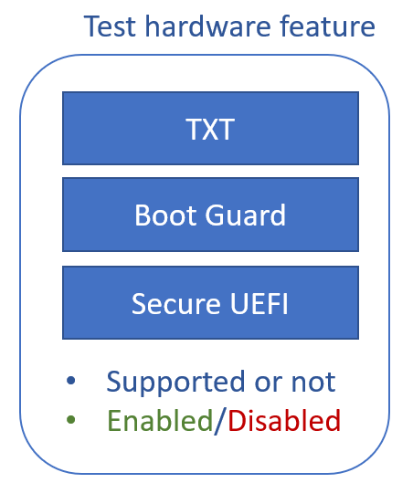
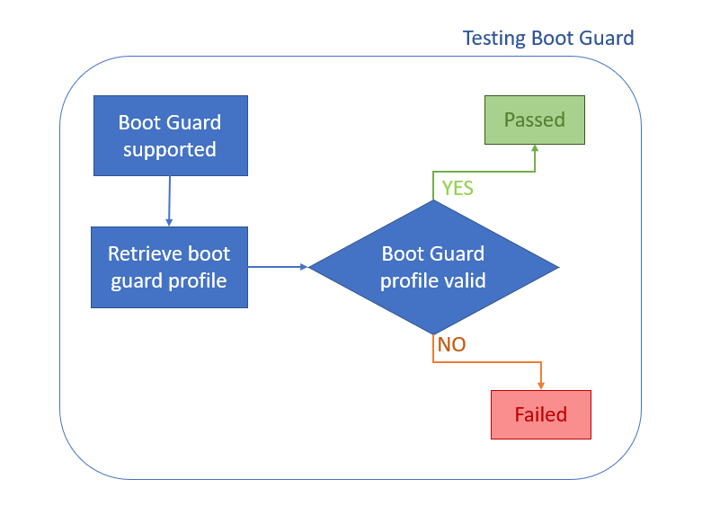
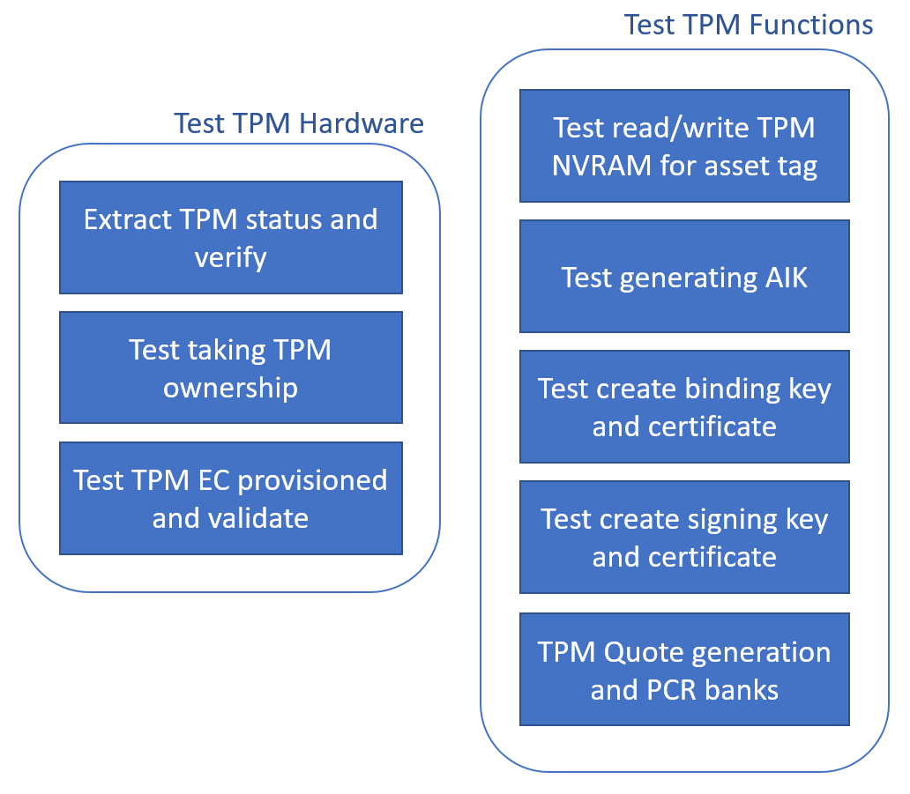
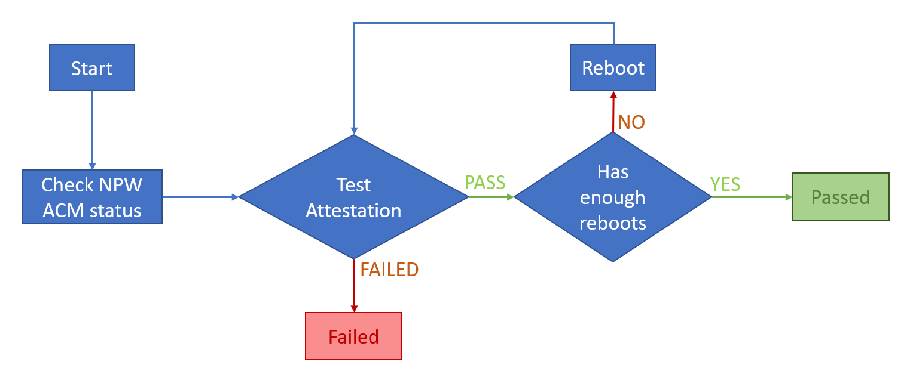
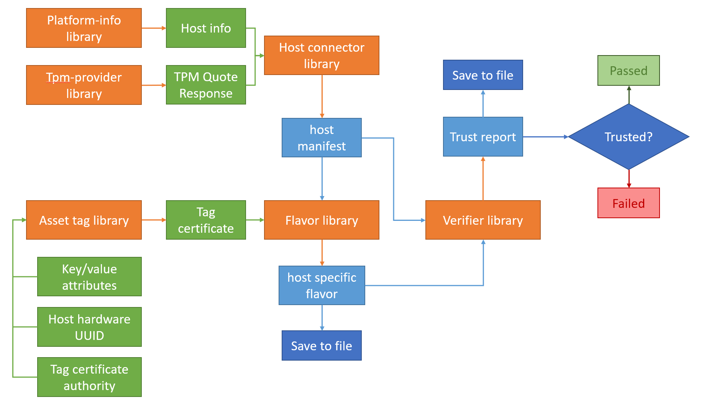

# BKC tool

## Introduction

Best Known Compatibility (BKC) tools is for enabling tests with BKC team internal to Intel.

The purpose of such program is for making sure that all ISECL components on node,
i.e. trust agent, workload agent and skc agent, are all running on settings that
do not pose conflicts with other Intel software product.

Such tool should install and configure required drivers and services on the platform
and validate platform support for ISECL components. The validation result shall
be shown as either PASS, FAILED or SKIPPED as described below

Result | Description
-------|-------------
PASS | Test for ISECL feature passed without error
FAILED | Test for ISECL feature failed, error logged in log files
SKIPPED | Hardware features required is not supported or not enabled

### Prerequisites

If applicapable, `tboot` should be configured before running `bkc-tool`

### Supported trusted boot configuration

TXT | Boot Guard | tboot | UEFI Secure Boot
----|------------|-------|------------
✔️ | ✔️ | ✔️ | ✔️
✔️ | ✔️ | ❌ | ✔️
✔️ | ✔️ | ✔️ | ❌
✔️ | ❌ | ✔️ | ✔️
✔️ | ❌ | ❌ | ✔️
✔️ | ❌ | ✔️ | ❌
❌ | ✔️ | ❌ | ✔️

## Requirements

### Installer

ID | Description
---|-------------
BKC05 | Installer shall place BKC tool binaries for enabling its use on command line
BKC06 | BKC tool binaries shall provides means to remove all BKC tools but keep TXT/TPM pre-requisites and configurations

### Testing - Hardware related

#### Tests conducted with `platform-info` library in Go

ID | Description
---|-------------
BKC07 | BKC tool shall test if TXT is supported, enabled or disabled
BKC08 | BKC tool shall test if Boot Guard is supported, enabled or disabled
BKC09 | If Boot Guard is supported, BKC tool shall try retrieving profile for it and return result in pass or failed
BKC10 | BKC tool shall test if Secure UEFI is supported, enabled or disabled
BKC11 | BKC tool shall detect NPW ACM presented if tboot is in use
BKC12 | BKC tool shall test if SGX is supported, enabled or disabled
BKC27 | BKC tool shall test if Overall Trusted Boot Configuration is supported

#### Tests conducted with `tpm-provider` library in Go

ID | Description
---|-------------
BKC13 | BKC tool shall extract and verify TPM status, include but not limited to enabled(or disabled), dTPM, fTPM and version
BKC14 | BKC tool shall test taking ownership of TPM
BKC15 | BKC tool shall test generating Attestation Identity Key (AIK)
BKC16 | BKC tool shall test reading TPM NVRAM for Asset Tag
BKC17 | BKC tool shall test writing TPM NVRAM for Asset Tag
BKC18 | BKC tool shall test TPM EC Provisioned and validated
BKC19 | BKC tool shall test creating binding key and certificate
BKC20 | BKC tool shall test creating signing key and certificate

### Testing - Software related, Trust Attestation

ID | Description
---|-------------
BKC24 | BKC tool shall test verifier for trusted report as output
BKC25 | BKC tool shall test asset tag deployment with TPM NVRAM
BKC26 | BKC tool shall test trust attestation after reboot arbitrary count of times
BKC27 | BKC tool shall generate and save flavor and trust report for validating consistency

## Design

### Introduction

The design for BKC tools is compromised of installer and BKC binary. Each of these
parts is responsible for respective requirements described above. The installer
shall be written in shell script for executing installation and configuration.
While the BKC binary shall be implemented in Go and utilize existing libraries
or packages that are identical to those linked to actual ISECL components.

Minimal gluing code and command line interface code shall be the only technical
efforts put into implementing such tool.

### Installer

The installer will create following directories and place in scripts and executable for `bkc-tool`

Make sure to run the tests after the service `tpm2-abrmd` is up. It can be checked with the following command

```shell
systemctl status tpm2-abrmd
```


#### Directory

Name | Description
-----|-------------
`/opt/bkc-tool/bin` | The directory where all the scripts and binary are placed
`/opt/bkc-tool/log` | The directory where all the test results are placed
`/opt/bkc-tool/log/flavor` | Stores flavor files used in previous tests
`/opt/bkc-tool/log/ca-cert` | Stores CA certificates and keys used in previous
`/opt/bkc-tool/log/host-manifest` | Stores host-manifest files used in previous
`/opt/bkc-tool/log/reports` | Stores trust report generated at certain time
`/opt/bkc-tool/var` | The directory where temporary files are stored

#### Files

Full path | Type | Description
----------|------|-------------
`/opt/bkc-tool/bin/bkc-tool.sh` | shell script | The entry point script to bkc-tool
`/opt/bkc-tool/bin/bkc-tool.bin` | executable | The Go executable for utilities
`/opt/bkc-tool/bin/reboot.sh` | shell script | The shell script for rebooting
`/usr/local/bin/bkc-tool` | soft link | Soft link linked to `/opt/bkc-tool/bin/bkc-tool.sh`


### BKC tool script `bkc-tool.sh`

The script specified in this section is exposed in the `$PATH` environment variable
which will invoke the BKC binary described later for separated testing steps. Thus acting like the entry point for `bkc-tool`. It will also get called automatically after reboot if related option is used.

#### Supported commands and flags

Create a soft link in `/usr/bin` and link it to `bkc-tool.sh`

Command | Flag |Description
--------|------|------------
`bkc-tool` | \- | Run hardware test and attestation test with two reboots
`bkc-tool hardware-test` | \- | Conduct `platform-info` and `tpm-provider` tests
`bkc-tool attestation` | \- | Test attestation one time without rebooting
\- | `-r <reboot-count>` | Test attestation consistency between multiple reboots, it should at least reboot 2 times
\- | `-c <reboot-countdown>` | (Optional) The count down time between running attestation test and reboot. Default to 10 seconds.
`bkc-tool uninstall` | \- | Remove `bkc-tool` binaries from system but keeping test results and logs
\- | `--purge` | Remove `bkc-tool` binaries, test results and logs from system

#### File system usage for outputs

Directory name | Description
---------------|-------------
`/opt/bkc-tool/log` | Stores log files with filenames `<test-name>-<time-stamp>.log`
`/opt/bkc-tool/log/flavor` | Stores flavor files used in previous tests with time stamp as filename
`/opt/bkc-tool/log/ca-cert` | Stores CA certificates and keys used in previous tests with time stamp as filename
`/opt/bkc-tool/log/host-manifest` | Stores host-manifest files used in previous tests with time stamp as filename
`/opt/bkc-tool/log/reports` | Stores trust report generated at certain time
`/opt/bkc-tool/var` | Stores a `reboot_cnt` file recording how many more reboots to do
\- | Stores `npw_acm` file indicating if `Non-Production-Worthy ACM` is detected
\- | Stores all other measurement files used for attestation
\- | Stores created flavor and trust reports when doing attestation tests

`Non-Production-Worthy ACM` shall be detected by checking for the value `pre_production: 1` in the `txt-stat` output. This is only relevant when tboot is in used.

Time stamps are all formatted to `yyyy.mm.dd-hh.mm.ss` and represents the time at which related test ended

#### Output logs

The output to log file of this script in the case of valid trust boot configuration:
```text
Trusted boot...PASS
Trusted boot configuration: TXT, Boot Guard, SecureBoot
```
```text
Trusted boot...FAILED
```

Otherwise, it will be:
```text
Trusted boot configuration not supported
Trusted boot...SKIPPED
```

#### Child scripts

`systemctl` script
```
[Unit]
Description=bkc-tool reboot

[Service]
Type=idle
WorkingDirectory=/opt/bkc-tool
ExecStart=/opt/bkc-tool/bin/reboot.sh

[Install]
WantedBy=multi-user.target
```

This script will be called from `systemd` when reboot option is used.

```shell
if [ ! -f $REBOOT_CTRL_FILE ]; then
	exit 0
fi

echo "reduce reboot count by one..." >> $REBOOT_LOG
cnt=$(cat $REBOOT_CTRL_FILE)
cnt=$(($cnt-1))
echo $cnt > $REBOOT_CTRL_FILE

echo "execute attestation test" >> $REBOOT_LOG
$MEASUREMENT_SCRIPT
$BKC_ATTEST_CMD >> $CURRENT_LOG_FILE
echo "bkc-tool attestation executed with return value $?" >> $REBOOT_LOG

if [ $cnt -eq "0" ]; then
	echo "no more reboot required" >> $REBOOT_LOG
	echo "moving test log and files to archive directory" >> $REBOOT_LOG
	timestamp=$(date +"%Y.%m.%d-%H.%M.%S")
	mv $CURRENT_LOG_FILE $LOG_DIRECTORY/$ATTESTATION_PREFIX$timestamp
	mv $CURRENT_FLAVOR_FILE $DIST_FLAVOR_DIR/$timestamp.json
	mv $CURRENT_CACERT_FILE $DIST_CACERT_DIR/$timestamp.crt
	mv $CURRENT_CAKEY_FILE $DIST_CAKEY_DIR/$timestamp.key
	mv $CURRENT_MANIFEST_DIR/* $DIST_MANIFEST_DIR/
	mv $CURRENT_REPORT_DIR/* $DIST_REPORT_DIR/
	echo "test log and files moved to archive directory" >> $REBOOT_LOG
	# if bkc_all exists, concat latest hardware log with attestation log
	if [ -f $ALL_TEST_CTRL_FILE ]; then
		echo "executing from bkc-tool without argument, concating logs" >> $REBOOT_LOG
		out_file="$LOG_DIRECTORY/$BKC_TEST_PREFIX$timestamp"
		hw_test_log=$(ls -tr $LOG_DIRECTORY/$HW_TEST_PREFIX* | tail -1)
		attest_test_log=$LOG_DIRECTORY/$ATTESTATION_PREFIX$timestamp
		cat $hw_test_log > $out_file
		cat $attest_test_log >> $out_file
		echo "logs concatinated" >> $REBOOT_LOG
		rm -rf $ALL_TEST_CTRL_FILE
	fi
	echo "clean up run directory..." >> $REBOOT_LOG
	rm -rf $RUN_DIRECTORY/*
	# just for safty reason
	echo "disable service after 5 seconds" >> $REBOOT_LOG
	sleep 5
	# disable reboot service
	systemctl disable $REBOOT_SERVICE >/dev/null 2>&1
	exit 0
fi
echo "$reboot_countdown seconds to reboot" >> $REBOOT_LOG
sleep $reboot_countdown
echo "rebooting..." >> $REBOOT_LOG
sleep 1
reboot
```

Add it to `~/.bashrc` with command
```shell
systemctl enable $REBOOT_SERVICE
systemctl enable $REBOOT_SERVICE
```
Remove it with
```shell
systemctl disable $REBOOT_SERVICE >/dev/null 2>&1
```

### BKC tool binary `bkc-tool.bin`

The following table specifies the commands that will be supported by BKC tool binary.
Such binary is invoked by `BKC tool script` for performing testing according to the
requirements.

Command | Flag | Description
--------|------|-------------
`bkc-tool.bin platform-info` | \- | Performs tests on `platform-info` library
`bkc-tool.bin platform-info ` | `--trusted-boot` | Validate and Returns trusted boot configuration
`bkc-tool.bin tpm-provider` | \- | Performs tests on `tpm-provider` library
`bkc-tool.bin attestation` | \- | Performs one or the first attestation test in a reboot sequence. This operation will overwrite existing flavor and self-signed certificate in `/opt/bkc-tool/var`
`bkc-tool.bin attestation ` | `-c` | Performs attestation consistency test. This will cause `bkc-tool.bin` to use existing flavor and self-signed certificate for attestation

#### Return values

While all commands return `0` on success and `1` on error,
following commands have specific return values for reference in control flow

Command | Flag | Return values description
--------|------|---------------------------
`bkc-tool.bin platform-info ` | `--trusted-boot` | If returned value is `2` means trusted boot configuration is not valid

### Hardware tests

#### `platform-info`

The purpose of this test is to check if `platform-info` library returns desired results.



[platform-info on GitLab](https://gitlab.devtools.intel.com/sst/isecl/lib/platform-info)

All of the listed hardware feature information can be found in `PlatformInfo` structure
returned by function `GetPlatformInfo`

##### Output

```text
HOST INFO...PASS
    OS: <os version>
    BIOS: <bios version>
    CPU ID: <cpu id>
    System UUID: <hardware UUID>
    BootGuard: Enabled
    BootGuard Profile:
    SecureUEFI: Enabled
    SGX: sgx_2_supported
```

#### Boot Guard



Boot guard related information can be found in `CBNT` structure that is nested
in `PlatformInfo.HardwareFeatures` field.

#### `tpm-provider`

The purpose of this test is to check if Operations on TPM returns desired results.



[tpm-provider on GitLab](https://gitlab.devtools.intel.com/sst/isecl/lib/tpm-provider)

Related functions are listed as following table. All of listed functions are defined
in interface `TpmProvider`.

Test objective | Function(s)
---------------|----------
Extract TPM status | `Version`
Take TPM ownership | `TakeOwnership`, `IsOwnedWithAuth`
TPM EC provisioned and validate | `PublicKeyExists`, `ReadPublic`
R/W TPM NVRAM | `NvDefine`, `NvRead`, `NvWrite`, `NvRelease`
Generating AIK | `CreateAik`, `GetAikBytes`, `GetAikName`
Creating binding and signing keys | `CreateSigningKey`, `CreateBindingKey`
TPM Quote and PCR banks | `GetTpmQuote`, `getPcrSelectionBytes`

**Note:** TPM Quote includes AIB, BK and event logs

##### Output

```text
TPM Version: 2.0
TPM Testing...PASSED
    TPM Active...PASSED
    TPM Ownership...PASSED
    TPM EC...PASSED
    TPM EK...PASSED
    TPM AIK...PASSED
    TPM Signing Key...PASSED
    TPM Binding Key...PASSED
    TPM Quote Generation...PASSED
    Asset Tag...PASSED
    TPM PCR Banks...PASSED
    Enabled PCR Banks: SHA1 SHA256
```

### Attestation test

The purpose of this test is to make sure the host manifest and the host specific flavor generate from it
can pass the flavor verification thus determine the system as trusted as the result.

### Overall flow



### Testing attestation detail

The data flow for utilizing different libraries to achieve testing the correctness of hardware features



If running test for testing attestation consistency, i.e. `bkc-tool.bin attestation -c`, `host specific flavor` should be loaded from existing file located at `/opt/bkc-tool/var/flavor`

If `npw_acm` exist, report can be untrusted but output will still show success as long as pcr 17 and 18 are the fault

### File output

Directory | File name | Description
----------|-----------|-------------
`/opt/bkc-tool/var` | `log` | Log file recording test results
\- | `flavor` | The host specific flavor generated for current run
\- | `ca.crt` | Self-signed certificate generated for current run
\- | `ca.key` | Self-signed certificate private key generated for current run
`/opt/bkc-tool/log/reports` | `<timestamp>` | Trust report generated at certain time

##### Output

This is the sample log output of multiple successful runs
```text
Attestation at <timestamp>...PASS
Attestation Consistency at <timestamp>...PASS
Attestation Consistency at <timestamp>...PASS
Attestation Consistency at <timestamp>...PASS
```

The output when `npw_acm` is detected. The message shall be ouptput bith `bkc-tool.sh`
```text
Warning: npw_acm detected, following results does not consider pcr 17 and 18
Attestation at <timestamp>...PASS
Attestation Consistency at <timestamp>...PASS
Attestation Consistency at <timestamp>...PASS
Attestation Consistency at <timestamp>...PASS
```

Timestamps showed in log file shall match the filenames in `/opt/bkc-tool/log/reports`

## Overall output to log file

**bind into one file**

### Success example for `hardware-test-<timestamp>.log`
```text
Trusted Boot...PASSED
    Trusted boot configuration: Boot Guard, SUEFI
HOST INFO...PASSED
    OS: RedHatEnterprise 8.1
    BIOS: Intel Corporation WLYDCRB1.SYS.0015.D04.2002051939
    CPU ID: A0 06 06 00 FF FB EB BF
    System UUID: 88888888-8887-0a00-2918-0111a5a5a5a5
    TXT: Disabled
    BootGuard: Enabled
    BootGuard Profile: BTGP5
    SecureUEFI: Enabled
    SGX: not_supported
TPM Version: 2.0
TPM Testing...PASSED
    TPM Active...PASSED
    TPM Ownership...PASSED
    TPM EC...PASSED
    TPM EK...PASSED
    TPM AIK...PASSED
    TPM Signing Key...PASSED
    TPM Binding Key...PASSED
    TPM Quote Generation...PASSED
    Asset Tag...PASSED
    TPM PCR Banks...PASSED
    Enabled PCR Banks: SHA1 SHA256
```

### Success example for `attestation-<timestamp>.log`
Assume rebooted 3 times
```text
Trusted Boot...PASSED
    Trusted boot configuration: Boot Guard, SUEFI
Attestation at <timestamp>...PASS
Attestation Consistency at <timestamp>...PASS
Attestation Consistency at <timestamp>...PASS
Attestation Consistency at <timestamp>...PASS
...
```

### Success example for `<timestamp>.log`

This is the file generated by concatenating `hardware-test-<timestamp>.log` and `attestation-<timestamp>.log` if running `bkc-tool` without any argument

```shell
latest_hw_result=$(ls -tr hardware-test-* | tail -1)
cat latest_hw_result >> timestamp.log
cat attestation-timestamp.log >> timestamp.log
```

```text
Trusted Boot...PASSED
    Trusted boot configuration: Boot Guard, SUEFI
HOST INFO...PASSED
    OS: RedHatEnterprise 8.1
    BIOS: Intel Corporation WLYDCRB1.SYS.0015.D04.2002051939
    CPU ID: A0 06 06 00 FF FB EB BF
    System UUID: 88888888-8887-0a00-2918-0111a5a5a5a5
    TXT: Disabled
    BootGuard: Enabled
    BootGuard Profile: BTGP5
    SecureUEFI: Enabled
    SGX: not_supported
TPM Version: 2.0
TPM Testing...PASSED
    TPM Active...PASSED
    TPM Ownership...PASSED
    TPM EC...PASSED
    TPM EK...PASSED
    TPM AIK...PASSED
    TPM Signing Key...PASSED
    TPM Binding Key...PASSED
    TPM Quote Generation...PASSED
    Asset Tag...PASSED
    TPM PCR Banks...PASSED
    Enabled PCR Banks: SHA1 SHA256
Trusted Boot...PASSED
    Trusted boot configuration: Boot Guard, SUEFI
Attestation at 2020.10.02-00.36.51: PASSED
Attestation at 2020.10.02-00.40.09: PASSED
```
